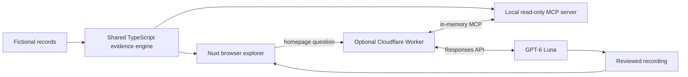

# Engineering Evidence Explorer

**Follow a recommendation back to the work behind it.** A Nuxt portfolio project by Jarrod Savard: explore a fictional engineering team, inspect pull requests, replay genuine GPT-6 Luna investigations, and ask your own evidence questions through MCP.

## Try it locally

Use **Node 24.11 or newer within Node 24** (`.nvmrc` selects 24). Node 25 is intentionally unsupported.

```sh
npm ci
npm run dev
```

For the public, static experience:

```sh
npm run build
npm run preview
```

Open `http://127.0.0.1:4187`. The preview is bound to loopback and uses a dedicated port to avoid another portfolio project's server. `PORT` can override it. The development server defaults to port 3000.

## Three investigations

| Investigation             | What to explore                                                                          |
| ------------------------- | ---------------------------------------------------------------------------------------- |
| Authentication reviewer   | Maya's recent authorship, Eli's recent reviews, and Leah's historical contributions.     |
| Billing & background jobs | Jonas and Priya's complementary contributions, with evidence kept separate by subsystem. |
| Disaster recovery         | A coverage gap. Observability contributions do not establish recovery expertise.         |

The homepage is a standalone live MCP workspace where visitors ask their own question, inspect the tool trace, and open cited PRs. Each guided investigation has interactive filtering, source inspection, and a separately labeled recorded AI session. The team directory at `/team` shows all 18 profiles and their work. All people, company details, pull requests, reviews, and illustrative snippets are independently authored fiction. None are copied from employer systems.

## How it works



The browser performs real deterministic retrieval without a model call. Recorded playback serves reviewed static JSON. A live run is a deliberate button press that calls a separate Cloudflare Worker; the Worker connects an MCP client and the same read-only server in memory, then calls GPT-6 Luna. The Worker streams each completed MCP call to the page before sending the verified answer. The timeline shows observable tool arguments and results, not private model reasoning. The browser never receives the API key. The site still works when the live endpoint is not configured.

The snapshot contains 18 contributors, 4 subsystems, and 72 PRs as of **June 30, 2026**. A contribution is recent when its date is between the snapshot date and 180 days earlier, inclusive. Results sort by recent authored count, recent reviewed count, most recent contribution, then stable contributor ID. Historical PRs remain inspectable. Reviews use the PR merge date as their temporal proxy; the sample does not model separate review timestamps.

Search normalizes case, accents, punctuation, and whitespace, then requires all query words to occur in the title, path, or illustrative diff. It does not perform semantic inference or search cautionary summary text. Contributor and role filters combine with the investigation's subsystem boundaries. Authorship/review filtering requires a selected contributor.

Counts are sample evidence, not an expertise score. Neither contributions nor the absence of records establish ownership, availability, or overall ability. No minimum evidence threshold turns a candidate into a certified expert.

## Code map

- `domain/`: typed fictional records, scenarios, shared retrieval, tool contracts, replay validation.
- `mcp/`: shared server registration plus the stdio transport adapter.
- `worker/`: optional live API, MCP client connection, rate limits, and daily budget.
- `app/`: Nuxt routes and components for investigations, evidence, recordings, and architecture.
- `scripts/`: static preview, recording capture/import/validation, visual checks.
- `tests/`: domain rules, actual SDK client/server integration, and browser workflows.
- `public/recordings/`: three reviewed genuine sessions; raw host exports are excluded.

The engine is independent of Vue and MCP. The adapters are small, explicit modules. There is no vector store, authentication or organization onboarding system, or general ingestion framework. The public Worker accepts a bounded free-text question about the fictional records with one of the three scenario IDs for page context; it is not a general chat or public MCP endpoint.

## Run the MCP server

```sh
npm run mcp
```

For an MCP host, use an absolute Node 24 executable path, project directory, and server path. Example configuration structure (adapt the host's syntax):

```json
{
  "mcpServers": {
    "evidence": {
      "command": "/absolute/path/to/node",
      "args": ["--import", "tsx", "/absolute/path/to/ai_mcp/mcp/server.ts"],
      "cwd": "/absolute/path/to/ai_mcp"
    }
  }
}
```

The server exposes only `list_subsystems`, `list_contributors`, `search_pull_requests`, `find_contributors`, `get_contributor_evidence`, and `get_pull_request`. Input schemas reject unknown fields, unsupported subsystem IDs, and arbitrary paths. Missing record IDs return explicit tool errors. All tools are read-only, deterministic, and restricted to bundled records. Protocol stdout contains no application logging. The implementation uses the official MCP TypeScript SDK 2.x packages.

## Recording provenance

All three bundled sessions were captured on September 25, 2026 using the OpenAI Responses API with `gpt-6-luna`. Every API response reported that exact model ID. The recorder connects the official MCP client and server locally, and preserves genuine tool names, arguments, results, durations, and the visible final answer. Raw API responses stay in ignored `.recordings/`; no hidden reasoning or credentials are published.

The input shown in replay is the actual supplied scenario question. Tool events appear in completion order. Durations measure local MCP calls, including protocol overhead; they are not model latency benchmarks. Automatic replay uses 2.4 seconds per step and is labeled as compressed timing.

To capture another session, put your project API key in the ignored `.env` file. API use consumes that project's quota:

```sh
npm run record:api -- authentication
npm run record:api -- billing-jobs
npm run record:api -- disaster-recovery
```

The older Codex CLI capture path remains available with `npm run record -- <scenario>`; its host export may not independently report the model. The API recorder is the published provenance path. Raw API responses and measured tool durations remain under ignored `.recordings/`.

**Before importing**, review the actual answer against the inspected sources, confirm every concrete claim is supported, and check that no personal or unrelated content is present. Then:

```sh
npm run recordings:import-api -- authentication --reviewed
npm run recordings:import-api -- billing-jobs --reviewed
npm run recordings:import-api -- disaster-recovery --reviewed
npm run recordings:release
```

The importer checks every returned model ID, exact visible answer, host tool calls, dataset hash, exact tool outputs, citations to observed PRs, and obvious incorrect recent/older labels. It rejects intermediate visible messages it cannot faithfully import. `--reviewed` records an explicit editorial assertion, not cryptographic proof. Human claim review remains necessary. Missing or invalid recordings show an unavailable state; release validation requires all three.

## Live GPT-6 Luna and limits

Copy `.env.example` to `.env` and set `OPENAI_API_KEY` there. An unquoted value such as `OPENAI_API_KEY=sk-...` is valid. `.env` and the generated `worker/.dev.vars` are ignored by Git. Set `LIVE_ALLOWED_ORIGIN` to the exact origin of the page that will call the Worker; for local static preview this is `http://127.0.0.1:4187`. Set `NUXT_PUBLIC_LIVE_API_URL=http://127.0.0.1:8787` for a local build, then run:

```sh
npm run live:dev
npm run build
npm run preview
```

The live Worker accepts a scenario ID and an optional question of 8–400 characters in a request body of at most 1,024 bytes. The standalone homepage uses `open-question` and requires a question; the three guided scenario IDs remain available for local recording tools. Browser requests ask for newline-delimited JSON events: observed MCP calls followed by a verified result or an error. The original JSON response remains available to local clients without that `Accept` header. The browser validates event shapes and requires the final result's tool list to match the streamed calls. The Worker rejects other origins and unexpected fields, advertises only six read-only MCP tools to GPT-6 Luna, and treats visitor text and tool results as untrusted for policy. For local development, the exact `localhost` and `127.0.0.1` aliases on the configured port are accepted. Production origins remain exact. Model output is rejected when it cites PRs it did not observe or plainly mislabels a cited PR as recent/older. When relevant PR evidence is available, the answer must inspect and cite at least one complete PR. There is no shell, browser, file path, upload, arbitrary URL, or repository connector available to the model. These boundaries reduce prompt-injection impact; no prompt alone can guarantee a model will ignore every malicious string. Visitors can inspect all evidence behind an answer.

Cloudflare limits each visitor IP to 3 runs per minute and each Cloudflare location to 12 runs per minute. A SQLite-backed Durable Object enforces a **global maximum of 20 live runs per UTC day**. Each run permits at most 60 seconds, 8 Responses API rounds, 20 MCP tool calls, and 3,500 output tokens per round. These bounds limit use of the paid API; the Worker rate limiter is approximate, while the durable daily counter is the global run cap. Local development uses the same code but does not represent a public abuse test.

For public hosting, create or sign in to a Cloudflare account, deploy the Worker, then transfer the two private values from `.env` to Worker secrets:

```sh
npx wrangler login
npx wrangler deploy --config worker/wrangler.jsonc
npm run live:secrets
```

Use `LIVE_ALLOWED_ORIGIN=https://<owner>.github.io` for a GitHub Pages project site; the repository path is not part of the origin. Configure the GitHub repository variable `LIVE_API_URL` with the deployed Worker URL before running the manual Pages workflow. The static site embeds only that public URL. It never embeds the API key. The live route consumes OpenAI API quota and may have charges; recorded playback and evidence browsing do not.

## Verify

```sh
npm test
npm run typecheck
npm run format:check
npm run recordings:release
npm run build
npm run live:check
npx playwright install chromium
npm run test:browser
```

Browser checks serve the static build, exercise desktop/mobile layouts, use actual recorded JSON, and check keyboard focus and WCAG A/AA rules with axe. Live orchestration tests mock the paid API while using a real in-memory MCP client/server connection and checking request limits. No AI access is needed for installation, tests, builds, or playback. The recording integration test also uses the real SDK over stdio.

With a preview already running, set `PLAYWRIGHT_BASE_URL` to its full origin. For subpath validation, build with `NUXT_APP_BASE_URL=/ai_mcp/` and run the base-path smoke script against a preview configured with that same value. The smoke test checks HTML, assets, route navigation, and recorded evidence.

## Publish on GitHub Pages

Source repository: [JarrodSavard/Engineering-Evidence-Explorer](https://github.com/JarrodSavard/Engineering-Evidence-Explorer). Website deployment is a separate manual step; pushing source code does not deploy the site or the live Worker.

1. In repository Settings → Pages, select GitHub Actions as the source.
2. Run the manual **Deploy portfolio** workflow. It validates, builds, tests the actual repository subpath, and uploads only the generated static site.

The workflow derives `NUXT_APP_BASE_URL` and the source-code URL from the repository, and reads `LIVE_API_URL` when the live Worker is ready. Locally, the source button points to the architecture explanation until `NUXT_PUBLIC_SOURCE_URL` is configured. No fictitious repository URL is displayed. A repository named `<owner>.github.io` uses the root path; other repositories use `/<repository>/`.

GitHub Pages hosting is available for public repositories on GitHub Free, subject to its limits. Cloudflare Workers and SQLite-backed Durable Objects can be used on Cloudflare's Free plan within its limits; the OpenAI API is billed separately. No custom domain or analytics service is required. Third-party hosting can still collect its own operational logs.

## Intentional boundaries and rights

This project demonstrates engineering decisions through a fixed fictional example. It has no real repository connector, organization onboarding, upload flow, or continuous ingestion. These limits reduce turnkey product usefulness; public code can still be copied or adapted.

Copyright © 2026 Jarrod Savard. All rights reserved. See [LICENSE](LICENSE) for the copyright notice and restrictions. Viewing and local execution of the bundled demo and tests are permitted solely for personal, noncommercial portfolio evaluation; reuse in another product or service, redistribution, and resale require prior written permission, subject to applicable law and platform terms. Public visibility is not a permissive open-source license. GitHub's platform terms still apply to public repositories, including viewing and forking. Dependencies and fonts retain their respective licenses; see [THIRD_PARTY_NOTICES.md](THIRD_PARTY_NOTICES.md).
